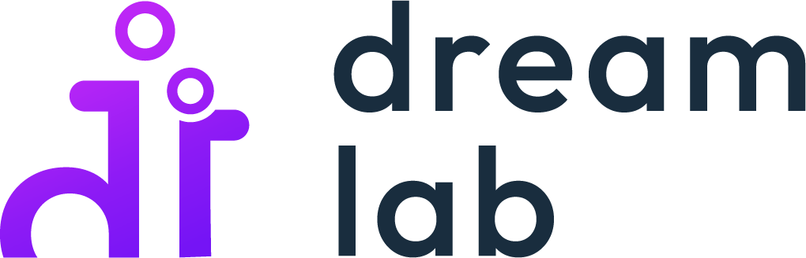
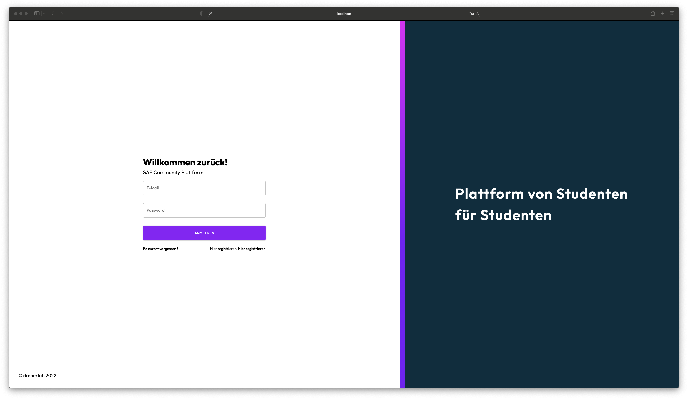

 
  

&#xa0;
<h2 align="center">Sae Community</h2>

&#xa0;

&#xa0;

 

  <a href="#dart-about">About</a> &#xa0; | &#xa0; 
  <a href="#white_check_mark-screenshots">Screenshots</a> &#xa0; | &#xa0;
  <a href="#checkered_flag-information">Information</a> &#xa0; | &#xa0;
  <a href="#memo-license">License</a> &#xa0; | &#xa0;
  <a href="https://github.com/abeerance" target="_blank">Author</a>

 

## :dart: About

This is a bachelor project on behalf of the SAE Institute in Zurich.

We strive to create a platform from students for students to make the local community more tightly knit and enhance the natural of meeting and exchanges.

## :white_check_mark: Screenshots

## :checkered_flag: Information

This project will not properly run on your local computer, since it requires a headless CMS as a backend, as well as the data structure we decided.

It's based on the Jamstack architecture.

## :memo: License

This project is under license from GNU v3.0.

  
Made with ❤️

  
Hadrian Chio

  
Sarah Candolfi

  
Jasmin Fischli

  
Fiona Hilpertshauser

  
Nikola Vucic

  
Claudio Mühle

  
Manuela Pfister

  
Michel Weber

&#xa0;

<a href="#top">Back to top</a>

